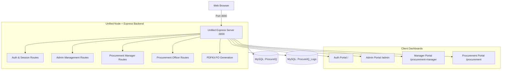

# ProcureIQ - Enterprise Procurement & Material Management

[](https://nodejs.org/)
[](https://www.mysql.com/)
[]()

ProcureIQ is an end-to-end Enterprise Procurement and Supply Chain Management platform designed for structured procurement workflows, approval hierarchies, vendor document management, and automated Purchase Order generation.

---

## 🏛️ System Architecture



---

## 📂 Project Structure

```text
NIMIT_PROCUREIQ/
│
├── frontend/                          # Client Dashboards (HTML, CSS, JS)
│   ├── auth-service/                  # Login portal
│   ├── admin/                         # Admin dashboard
│   ├── procurement-manager/           # Manager dashboard
│   └── procurement/                   # Procurement officer dashboard
│
├── backend/                           # Unified Node + Express Backend
│   ├── src/
│   │   ├── config/                    # Database pools & environment config
│   │   │   └── db.js
│   │   ├── controllers/               # Route controllers (Auth, Users, PR, etc.)
│   │   ├── middleware/                # Session, RBAC, and Multer upload middleware
│   │   ├── routes/                    # Modular Express route definitions
│   │   ├── services/                  # PDF generation, Vendor docs, Audit logs
│   │   ├── utils/                     # Technical logger & filename sanitizers
│   │   └── app.js                     # Express application configuration
│   │
│   ├── fonts/                         # Custom TTF fonts for Purchase Order PDFs
│   ├── purchase-orders/               # Generated Purchase Order PDFs (Git-ignored)
│   ├── proforma-invoice/              # Supplier invoices (Git-ignored)
│   ├── vendor/                        # Uploaded vendor compliance records (Git-ignored)
│   ├── .env                           # Backend environment variables
│   ├── package.json                   # Single unified backend package.json
│   └── server.js                      # Application server entrypoint (Port 3000)
│
├── database/                          # Database schemas and documentation
│   ├── schemas/
│   │   ├── 01_procureiq.sql           # Primary application schema
│   │   └── 02_procureiq_logs.sql      # Logging and audit schema
│   └── README.md
│
├── docs/                              # Technical & architecture documentation
│   └── architecture.md
│
├── scripts/                           # Lifecycle & utility scripts
│   ├── start-all.js
│   └── stop-services.ps1
│
├── .env.example                       # Master environment variable template
├── .gitignore                         # Enterprise-grade git ignore configuration
├── package.json                       # Root monorepo configuration
├── start-services.bat                 # One-click Windows server launcher
└── README.md                          # Project documentation
```

---

## 🚀 Quick Start

### 1. Prerequisites
- **Node.js**: `v18.0.0` or higher
- **MySQL Server**: `8.0` or higher running on port `3306`

### 2. Database Initialization
Ensure MySQL service is running, then load the schemas:
```bash
mysql -u root -p < database/schemas/01_procureiq.sql
mysql -u root -p < database/schemas/02_procureiq_logs.sql
```

### 3. Start the Server
Run from the root directory:
```bash
npm start
```
*Or double-click [`start-services.bat`](file:///c:/Users/sahil/Documents/NIMIT_PROCUREIQ/NIMIT_PROCUREIQ/start-services.bat).*

Access the application in your browser: **[http://localhost:3000](http://localhost:3000)**

---

## 🌐 Unified Port & Access Matrix

All portals run under a unified server on **Port 3000**:

| Portal | URL | Access Permission |
| :--- | :--- | :--- |
| **Login Gateway** | [http://localhost:3000/](http://localhost:3000/) | Public / All Users |
| **Admin Portal** | [http://localhost:3000/admin](http://localhost:3000/admin) | `ADMIN` |
| **Procurement Manager** | [http://localhost:3000/procurement-manager](http://localhost:3000/procurement-manager) | `PROCUREMENT_MANAGER` |
| **Procurement Portal** | [http://localhost:3000/procurement](http://localhost:3000/procurement) | `PROCUREMENT` |

---

## 🔐 Default Credentials

| Username | Role | Password |
| :--- | :--- | :--- |
| `admin` | `ADMIN` | `Password@123` |
| `manager` | `PROCUREMENT_MANAGER` | `Password@123` |
| `procurement` | `PROCUREMENT` | `Password@123` |
| `admin2` | `ADMIN` | `admin2` |