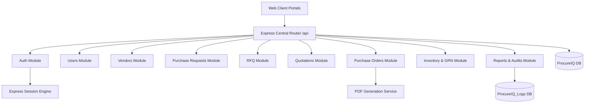

# ProcureIQ System Architecture

## Overview
ProcureIQ is an enterprise procurement management suite designed for engineering and manufacturing operations. It covers the full lifecycle of procurement: Purchase Requisitions, Vendor Inquiries & RFQs, Commercial Quotation Comparisons, Purchase Order Generation with Auto-Sequenced Numbering, Digital PDF Generation, Order Tracking, Goods Receipt Notes (GRN), Vendor Returns, and Real-time Auditing.

## Modular Architecture

## Directory Organization
- `backend/src/modules/`: Domain-driven feature packages grouping controllers, services, repositories, routes, and validation schemas.
- `backend/src/middleware/`: Authentication (`auth.middleware.js`), Role-Based Access Control (`rbac.middleware.js`), Validation, Upload, and Error handling.
- `backend/src/services/`: Cross-cutting technical services (PDF generation, Sequence generation, Audit logging, Email).
- `backend/storage/`: Structured persistent storage for PO documents, vendor attachments, and proforma invoices.
