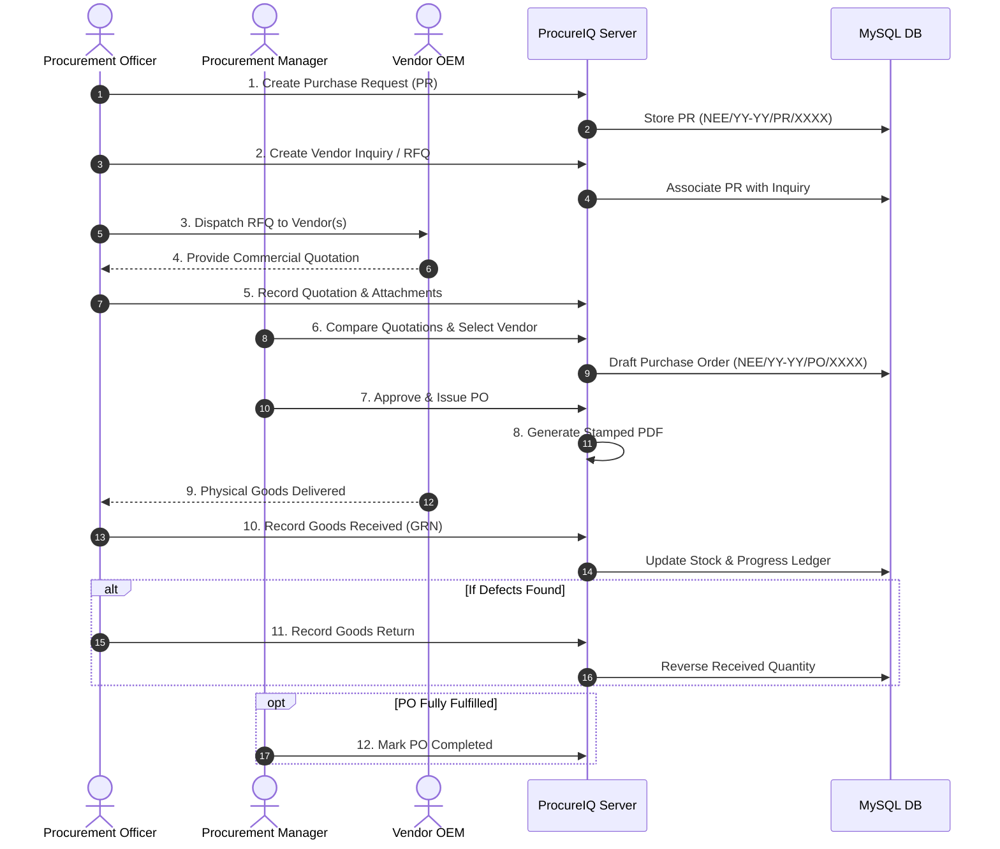

# End-to-End Procurement Workflow

## Step-by-Step Lifecycle
1. **Requisition**: Initiated by project site or engineering team. Auto-assigned serial number `NEE/YY-YY/PR/XXXX`.
2. **Vendor Inquiry / RFQ**: Multiple eligible OEM vendors are invited to bid on specification.
3. **Quotation Comparison**: Commercial evaluation of unit rates, delivery timelines, payment terms (Advance, Credit, Advance+Balance), and freight.
4. **PO Issuance**: Generates formal purchase order with legally binding terms and auto-generated PDF with company header.
5. **Inventory Receipt (GRN)**: Gatekeeper checks shipment against PO line items. Partial receipts supported.
6. **Returns & Fulfillment**: Returned goods are logged with reason; order auto-tracks remaining balance.
